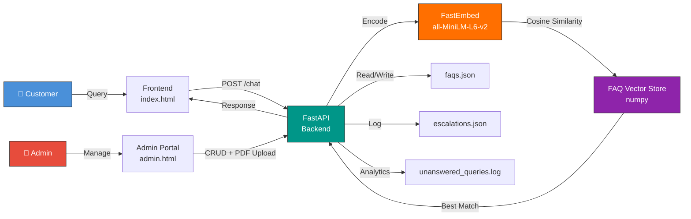

<div align="center">

# 🚗 AutoCare

**AI-Powered Semantic FAQ Chatbot & Knowledge Management System for Maruti Suzuki** 🇮🇳

[](https://python.org)
[](https://fastapi.tiangolo.com)
[](https://qdrant.github.io/fastembed/)
[](LICENSE)
[](https://autocare-frontend.onrender.com/)

Enterprise-grade customer support automation with semantic search, real-time FAQ matching, and intelligent department routing — built without heavy ML frameworks.

[Documentation](https://shivanshi-git.github.io/AutoCare/) · [Live Demo](https://autocare-frontend.onrender.com/) · [Admin Portal](https://autocare-frontend.onrender.com/admin.html) · [API Docs](http://127.0.0.1:8000/docs)

</div>

---

## 📐 System Architecture



## ⚡ Key Features

<table>
<tr>
<td align="center" width="25%">

### 🧠 Semantic Search
Vector similarity matching using **FastEmbed ONNX** (`all-MiniLM-L6-v2`). Handles paraphrases and natural language queries without keyword dependency.

</td>
<td align="center" width="25%">

### 🏷️ Smart Routing
Auto-classifies incoming queries into **Service & Maintenance**, **Insurance**, **Spare Parts**, **Roadside Assistance**, or **General** departments.

</td>
<td align="center" width="25%">

### 📄 PDF Ingestion
Upload PDF documents to **auto-extract Q&A pairs** using multi-strategy parsing (tagged, heuristic, fallback). Instantly indexed and searchable.

</td>
<td align="center" width="25%">

### 📊 Gap Analytics
Logs **unanswered queries** and **negative feedback** to identify knowledge base gaps. Admin dashboard for real-time review and escalation tracking.

</td>
</tr>
</table>

## 🛠️ Tech Stack

| Layer | Technology | Purpose |
|:---:|:---|:---|
| **Backend** | FastAPI + Uvicorn | Async REST API server |
| **Embeddings** | FastEmbed (ONNX Runtime) | Lightweight semantic encoding (~100MB RAM) |
| **Model** | `all-MiniLM-L6-v2` | 384-dim sentence embeddings |
| **Vector Ops** | NumPy | Cosine similarity computation |
| **PDF Parser** | PyPDF | Document text extraction |
| **Frontend** | Vanilla HTML/CSS/JS | Zero-dependency UI |
| **Auth** | Bearer Token (HTTPBearer) | Admin endpoint protection |

## 🚀 Quick Start

```bash
# Clone
git clone https://github.com/shivanshi-git/AutoCare.git
cd AutoCare
```

**Terminal 1 — Backend:**
```bash
cd backend
pip install -r requirements.txt
python main.py
# → http://127.0.0.1:8000
```

**Terminal 2 — Frontend:**
```bash
cd frontend
python -m http.server 3000
# → http://127.0.0.1:3000
```

**One-liner (PowerShell):**
```powershell
Start-Process cmd -ArgumentList '/k cd /d backend && pip install -r requirements.txt && python main.py'
Start-Process cmd -ArgumentList '/k cd /d frontend && python -m http.server 3000'
```

## 🌐 Live Demo

| Interface | URL |
|:---|:---|
| **Customer Chatbot** | [autocare-frontend.onrender.com](https://autocare-frontend.onrender.com/) |
| **Admin Dashboard** | [autocare-frontend.onrender.com/admin.html](https://autocare-frontend.onrender.com/admin.html) |
| **API Swagger Docs** | `http://127.0.0.1:8000/docs` (local) |

> **Admin API Key:** `admin-secret-key`

## 📡 API Reference

| Method | Endpoint | Auth | Description |
|:---:|:---|:---:|:---|
| `POST` | `/chat` | ✗ | Semantic FAQ matching — returns best answer + confidence |
| `GET` | `/api/qa` | ✗ | List all FAQ entries |
| `POST` | `/api/qa` | ✓ | Add new Q&A pair (auto-embeds & indexes) |
| `DELETE` | `/api/qa` | ✓ | Remove Q&A pair by question text |
| `POST` | `/api/upload-pdf` | ✓ | Extract & ingest Q&A pairs from PDF |
| `POST` | `/api/escalation` | ✗ | Submit customer escalation ticket |
| `GET` | `/api/escalation` | ✓ | List all escalation tickets |
| `PUT` | `/api/escalation` | ✓ | Update ticket status |
| `DELETE` | `/api/escalation/{id}` | ✓ | Delete escalation ticket |
| `GET` | `/api/unanswered` | ✓ | View unanswered query gaps |
| `POST` | `/api/feedback` | ✗ | Submit thumbs up/down feedback |
| `GET` | `/api/verify` | ✓ | Validate admin API key |

## 📂 Project Structure

```
AutoCare/
├── backend/
│   ├── main.py                 # FastAPI app — routes, embeddings, matching
│   ├── faqs.json               # Knowledge base (55+ Q&A pairs)
│   ├── escalations.json        # Customer escalation tickets
│   ├── unanswered_queries.log  # Gap analytics log
│   └── requirements.txt        # Python dependencies
└── frontend/
    ├── index.html              # Customer chat interface
    ├── admin.html              # Admin management dashboard
    ├── script.js               # API client & UI logic
    └── style.css               # Responsive styling
```

## 🔄 How It Works

```
User Query → FastEmbed Encode → Cosine Similarity vs FAQ Embeddings
                                         ↓
                              Score ≥ 0.45 → Return matched FAQ answer
                              Score < 0.45 → Log to gaps + fallback message
```

1. User submits a query via the chat interface
2. Backend encodes the query into a 384-dim vector using FastEmbed
3. Computes cosine similarity against pre-computed FAQ embeddings
4. Returns the best match if confidence ≥ 45%, otherwise logs it as a knowledge gap
5. Admin reviews gaps and adds missing Q&A pairs via the dashboard

## 🤝 Contributing

Pull requests welcome. For major changes, open an issue first.

## 📄 License

MIT
